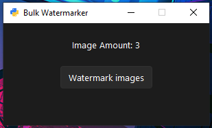

# Bulk-Watermarker



Required Modules
```
py -m pip install Pillow
```

To-Do
```
- Transparancy Options
- Size Scaleing (Watermark-Scaling with image size)
```

This is something I slapped up for some practice.
